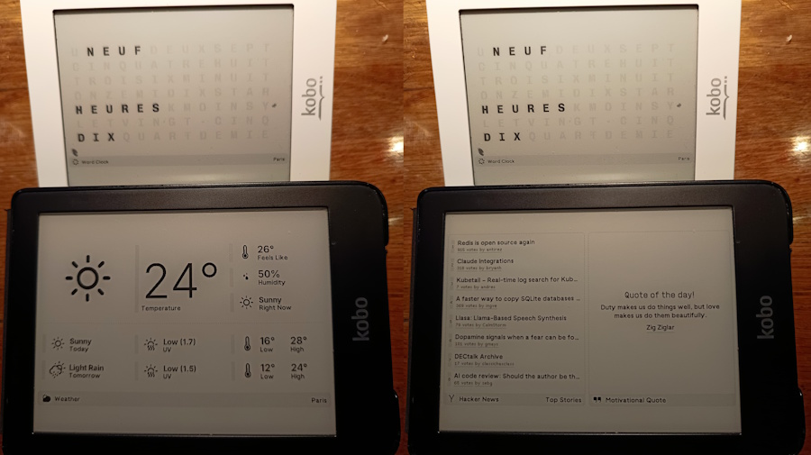
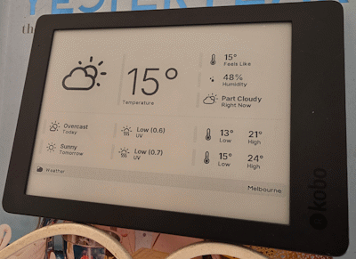
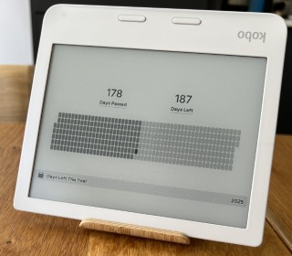
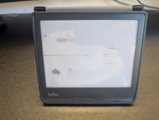
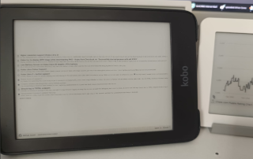
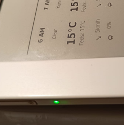
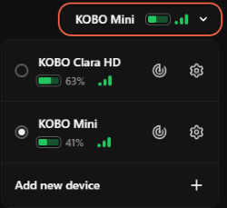

# Turn Your Kobo into a TRMNL client
This repository contains the implementation and a guide to make your kobo acts as a TRMNL client on demand.

**This is a work in progress**

" *TRMNL is an e-ink display that connects with popular products and renders their most useful information. We believe this black & white, focused, hands-off approach is the best way to stay informed without getting distracted [TRMNL website](https://usetrmnl.com/).* "



### Reported working on
- Kobo Mini (x2)
- Kobo Clara HD (x3)
- Kobo Clara 2E 
- Kobo Aura Second Edition - (Device without activity Led)
  - 
- Kobo Libra 2
  - 
- Kobo Libra 2 Color 
  - 

  

## Sumary
This will add a menu entry to start TRMNL app to your kobo. 
- The TRMNL app will periodically request a dashboard screen to be displayed on the Kobo screen.
- The refresh rate is given by the server
- In between request the Kobo will be put to sleep, and will wake up for the next update.
- When awake the charging led of the Kobo is lit to let you know that the wifi is being turned on and a request being sent.

This repository structure is:
- ./src/ : contains the TRMNL client implementation (mainly scripts, heavily inspired by koreader < attribute to author >)
- ./doc/distrib : contains the prerequisites and sources, for references and archival (some where found on the internet wayback machine) 
  - nickelmenu: adds a new tab to your kobo that allows you to start external app < ref author >
  - kobostuff: adds tools to your kobo < ref author >
  - rtcwake: patched busybox binary to allow to set up rtc wake up alarm on kobo < ref author / wayback machine>

## Dependencies & Acknowledgements

This project wouldn’t be possible without the incredible work of the open-source community. Here are the dependencies that make this project work:

- [Nickel Menu](https://pgaskin.net/NickelMenu/) – NickelMenu adds custom menu items to various menus in Kobo's eReader software
- [Niluje's Kobostuff](https://www.mobileread.com/forums/showthread.php?t=225030&highlight=kobostuff) – Packages targeting Kobo devices (eg: curl, jq, convert (image magic))
- [patched rtcwake](https://web.archive.org/web/20160401013708/http://www.scherello.de/rtcwake_kobo.zip) + [discussion MobileRead](https://www.mobileread.com/forums/showthread.php?t=212145&page=5) – patched binary to have a working rtcwake on kobos
- [KOReader](https://github.com/koreader/koreader) Source of inspiration / knowledge to make this work

## Prerequisites

- Kobo device connected to wifi
- If you want to benefit to the awesome TRMNL ecosystem you will need a TRMNL API key (physical device or [BYOD license](https://shop.usetrmnl.com/products/byod)), or point to your own TRMNL server [BYOS](https://docs.usetrmnl.com/go/diy/byos)

## Installation
Here are the steps to get the TRMNL app working on your Kobo (show hidden folder in your computer if you don't see folder starting with a dot)
- Install NickelMenu on your Kobo **(only needed once, skip this step if upgrading from previous release)**
  - Connect your Kobo with Usb, copy **KoboRoot.tgz** to the folder name **.kobo** safely eject and restart.
  - Available in this repo in /doc/distrib/nickelmenu
- Install Kobostuff **(only needed once, skip this step if upgrading from previous release)**
  - Connect your Kobo with Usb, copy **KoboRoot.tgz** to the folder name **.kobo** safely eject and restart.
  - Available in this repo in the archive **/doc/distrib/kobostuff/kobo-stuff-1.6.N-r18901.tar.xz**
- Copy TRMNL folder to the Kobo in **.adds** folder (to get **.adds/TRMNL/**) from the latest release: [releases](https://github.com/usetrmnl/trmnl-kobo/releases)
  - If upgrading, take care of your config.json
- Edit **config.json** located in **.adds/TRMNL** to setup:
  - **TrmnlId**: Device Id/Mac address
  - **TrmnlToken**: Device token/API key
  - **TrmnlApiUrl**: Change this if your Bringing Your Own Server (BYOS)
  - **LoopMaxIteration**: Set to 0 to run indifinitely (for initial setup/troubeleshooting, pick a small number, so that the KOBO automatically restart)
  - **ConnectedGracePeriod**: If your KOBO regularly shows connection issue, increase this (delay in seconds after requesting to connect to the wifi, to request a TRMNL display information and image).
  - **ImageFormat**: bmp to behave like TRMNL OG, png, if you configured your device to something else (Kobo Libra, Kindle PW 7th gen for Clara HD).
    - Note: DPI might be too big, below Kindle PW 7th gen for Clara HD: 
    - 
    - Note: If using TERMINUS and PNG media/type, please [see guide to fix orientation](https://github.com/usetrmnl/trmnl-kobo/issues/17#issuecomment-3237420484), thanks [z0rzi](https://github.com/z0rzi)
  - Default is:
```
{
    "TrmnlId": "your TRMNL Mac Address",
    "TrmnlToken": "your TRMNL API Key",
    "TrmnlApiUrl": "https://usetrmnl.com/api",
    "DebugToScreen": 0,
    "LoopMaxIteration": 0,
    "ConnectedGracePeriod": 0,
    "ImageFormat": "bmp" 
}
````

- Copy the file TRMNL.ini to **.adds/nm** folder (to create a menu entry) 
  - (Located in src/nm/TRMNL.ini in this repo)
- TRMNL app can be started using NickelMenu
   -  
- To exit your Kobo when running the TRMNL loop, when powered off (sleeping between cycle), power it on (and release power button), and then hold the power button down until the power light blinks rapidly (or blue on mini). When the power light stops blinking, or lights up blue and glows solid, release the power button.


## FAQ
- How to get out of TRMNL loop ?
    - To exit your Kobo when running the TRMNL loop, when powered off (sleeping between cycle), power it on (and release power button), and then hold the power button down until the power light blinks rapidly (or blue on mini). When the power light stops blinking, or lights up blue and glows solid, release the power button.
- Why do sometimes I see a connection issue when KOBO's waking up ?
  - If your wifi connection is bad, it may takes more time than the alloted delay to connect to the Wifi, if this is the case, it can be fixed using ```ConnectedGracePeriod``` setting in config.json to increase the time to connect to the wifi.

## Digging into sources

trmnl.sh is the starting scripts, it is heavily inspired from KOreader.
It is started by a nickel menu entry, and starts by setting up the kobo environment to start the TRMNL fetch/display/sleep loop.

The fetch/display/sleep if performed by trmnlloop.sh script called in a loop by trmnl.sh. It will 
- enable battery charge led to inform activity
  - 
- connect to wifi
- read battery status (*/sys/class/power_supply/mc13892_bat/capacity*) and convert to % to Voltage (guestimate based on API)
  - 
- fetch image information via curl (and report battery status), 
- parse information via jq (image url and refresh rate)
- fetch the image
- rotate the display with fbdepth (if needed, using PNG mode and high DPI, TRMNL api is already inverted)
- print it with fbink
- disable wifi
- disable charging led
- plan next wake up alarm using rtcwake for the time request by the server
- sleep (suspend to memory) using rtcwake or suspend to memory if rtcwake can't do it
  - a swipe on screen will wake the device up and force a refresh 
